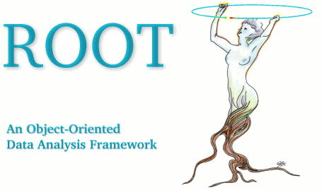

# A PROOF Guide For Beginners {.unnumbered}

***Abstract:***

PROOF is a framework to process ROOT trees in parallel using a pull architecture
for work distribution. The main underlying assumption being the embarrassing parallel
nature of the task at hand, PROOF can also be used for any other task of such a nature,
including full or toy simulations or mathematical evaluations.
This introductory guide illustrates the main features and usage of PROOF, introduces
the relevant terminology and dissects a number of meaningful examples. 

<!--   -->
